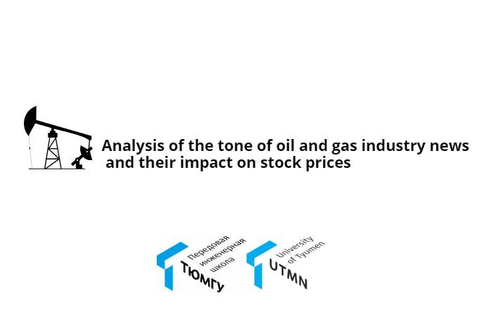

      

## About

Analysis of the tonality of the text of oil and gas industry news and their impact on quotes.

Made as part of a training project on the discipline of natural language processing.

## Developers

- Khrupin Danila (https://github.com/DanilaStanislavovich)
- Tamerlan Muradov (https://github.com/Tam7k)
- Ovchinnikova Anna (https://github.com/OvchinnikovAnna)

## Description of files

      <a href="/parser.py">parser.py</a> - the code of the site parser for the purpose of collecting news for the year.
      In this case, the year variable is the desired year. As a result of its execution, a csv file is created where the name of the news with the release time is      
      indicated.

